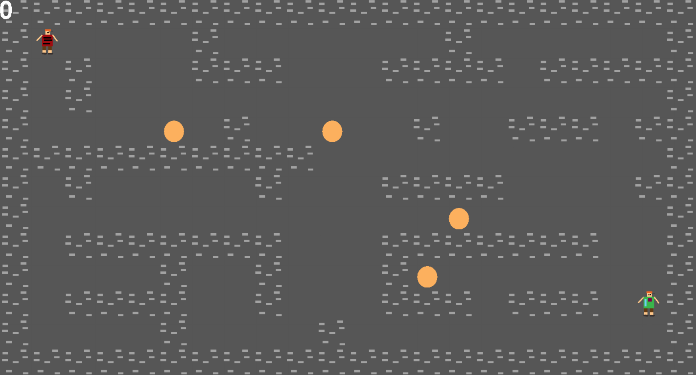

# Bomberman

Bomberman is a game developed using python and pygame that can be played against an AI that can 'play' one of the alpha-beta or min-max algorithms. All the assets were made in Adobe Photoshop.

